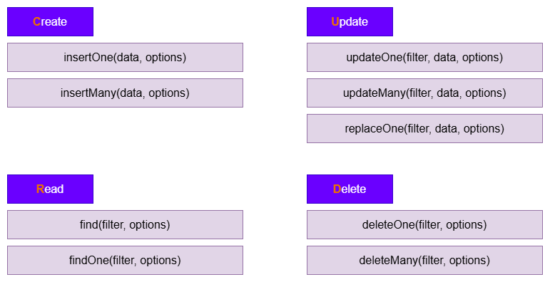

# Introdução a Nosql/Mongodb
## O que é Nosql?
- **NoSQL** é um **paradigma de banco de dados** que engloba diversos tipos de bancos de dados não relacionais.
- Projetados para oferecer:
   - Flexibilidade
   - Escalabilidade
   - Alto desepenho
##  Os quatro paradigmas de banco de dados NoSql são:
   - **Banco de dados orientados a documentos** (ex: mongoDb)
   - **Banco de dados chave-valor** (ex: Redis)
   - **Bancos de dados de famílias de colunas (wide-column)** (ex: Cassandra)
   - **Bancos de dados orientados a grafos** (ex.: Neo4j)
# O que é MongoDB?
   - O que significa **"Mongo"**?
      - o **Humongous** (Gigante) — o **MongoDB** foi projetado para armazenar e gerenciar grandes volumes de dados de forma eficiente.
   - MongoDB é um banco de dados NoSQL de **código aberto, orientado a documentos**, projetado para armazenar e gerenciar grandes quantidades de dados de maneira eficiente.
   - Diferentemente dos bancos de dados relacionais tradicionais (como MySQL ou PostgreSQL), o MongoDB **armazena os dados em documentos**, em vez de linhas em tabelas
# Como o MongoDB funciona?
   - Um servidor MongoDB pode hospedar múltiplos bancos de dados.
   - Cada banco de dados contém coleções (collections), e cada coleção armazena documentos (documents).
   - Todo registro no MongoDB é, na verdade, um **documento**.
   - Os documentos são armazenados no MongoDB em um formato semelhante ao JSON, chamado **BSON (Binary JSON)**.
   - Os documentos **BSON** são objetos que contêm uma lista ordenada dos elementos que armazenam.
   - Cada elemento é composto por um **nome de campo (field name)** e um **valor** de um determinado tipo.
## Relacionamentos
   - Diferentemente dos bancos de dados relacionais, o MongoDB **minimiza o uso de relacionamentos entre coleções**.
   - **Em vez de dividir** os dados relacionados em várias tabelas e depois uni-los por meio de JOINs, o MongoDB geralmente **armazena esses dados juntos** no mesmo documento utilizando documentos incorporados (embedded documents).
## Controles principais
   - mongosh
   - show databases / show dbs
   - use shop
   - show collections
   - db.<collection_name>.insertOne({<object>>})
   - db.createCollection("<collection_name>")
   - db.<collection_name>.find()
## Como funciona o arquivo Json
   - name": "jefté" é chamado de campo (field) ou propriedade (property) do documento JSON. Múltiplos campos são separados por vírgulas.
   - Os **campos (fields)** são compostos por uma **chave (key)**, também chamada de **nome (name)**, e um **valor (value)**. A chave e o valor são separados por dois-pontos (:).
   - Os **valores (values)** podem ser **strings** (por exemplo, "Jefté"), **números** (por exemplo, 35), **booleanos** (por exemplo, true), **arrays** ([... ]) e **outros documentos** (também chamados de **objetos**; { ... }).

   - Exibir os bancos de dados
         - show databases

   - Criar banco de dados
         - use loja_informatica

   - Criar nova collection
         - db.createCollection("cliente")

   - Mostar todas as collections
         - show collections

   - Mostrar todos os documentos/objetos
         - db.cliente.find()

   - Insere apenas 1 document (objeto)
       - db.cliente.insertOne({   "nome": "jefté",   "idade": 35,   "pets": ["dora", "sabrina"],      "endereco": {    "logradouro": "Sossego"   }})

   - Inserir Muitos documents de uma vez
         - db.cliente.insertMany([{ "nome": "Brenno"}, { "nome": "João"}, { "nome": "MAria"}, { "nome": "José"}, { "nome": "Noé"}])

   - Buscar pelo campo
      - db.cliente.find({"nome": "José"})

   - Buscar pelo identificador único
      - db.cliente.find({_id: ObjectId('6a7bbab007ff2cf8649f68a9'),})
